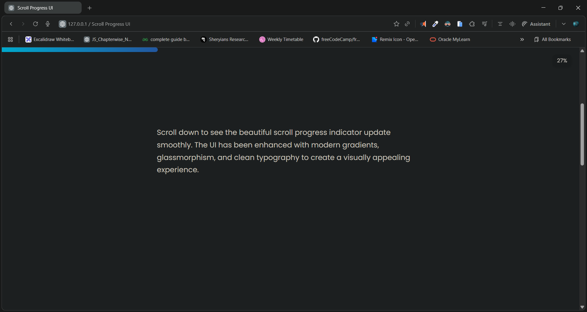

# 🚀 Smooth Scroll Progress UI

A modern and minimal scroll-progress indicator built with **HTML, CSS, and JavaScript**.
This UI features a smooth animated progress bar and a floating percentage label that updates as users scroll through the page.

---

## 📸 Preview

> 

---

## 🎥 Demo Video

> 🎬 **Watch Demo:** [click to watch](./demo.mp4)

---

## 🌐 Live Demo

> 🔗 **Live Site:** []()

---

## 📁 Project Structure

```
├── index.html
├── script.js
```

---

## 🛠️ Features

* ✔️ Smooth scroll-based progress animation
* ✔️ Gradient progress bar with soft rounded edges
* ✔️ Floating glass-effect progress label
* ✔️ Clean typography using Google Fonts
* ✔️ Fully responsive
* ✔️ Simple, lightweight, and dependency-free

---

## 🧩 How It Works

### **1. HTML Structure**

The page includes a fixed progress bar and a floating label element.


### **2. CSS Styling**

* Gradient bar
* Glassmorphism label
* Full-screen hero section
* Smooth transitions

*All styling is inside the `<style>` block in `index.html`.*


### **3. JavaScript Logic**

The scroll percentage = `(scrollY / main.offsetHeight) * 100`
The bar width and label text update in real time.


```js
let percent = Math.ceil((window.scrollY / main.offsetHeight) * 100);
progressBar.style.width = percent + "%";
label.textContent = percent + "%";
```

---

## 🚀 Getting Started

### Clone the repo

```bash
git clone 
```

### Open in browser

Simply open `index.html` in any browser.
No dependencies, no build step.

---

## ✨ Customization

You can easily modify:

### 🔹 Colors

Edit the gradient inside `#bar`

```css
background: linear-gradient(90deg, #00d2ff, #3a7bd5);
```

### 🔹 Font

Change the Google Font in the `<head>` section.

### 🔹 Scroll length

Adjust `main` height for more or less scrollable space.

---

## 📄 License

This project is **free to use** for personal and commercial purposes.

---

## 🧑‍💻 Author

Built by **Dileep**
🔥 Passionate Frontend & Full-Stack Developer
- 📧 [dileepkumawat525@gmail.com](mailto:dileepkumawat525@gmail.com)
- 🔗 [LinkedIn](https://www.linkedin.com/in/dileep-kumawat/)


---

## 🤝 Contributing

Feel free to submit pull requests or report issues.

---